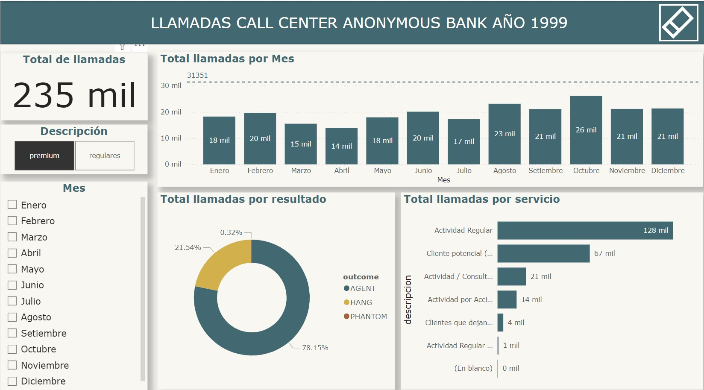
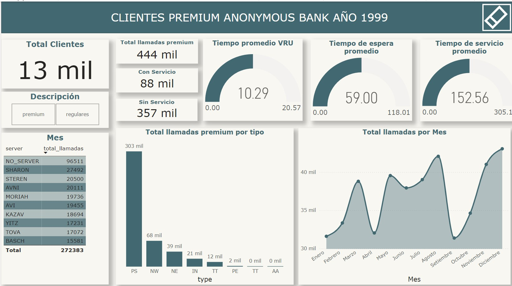
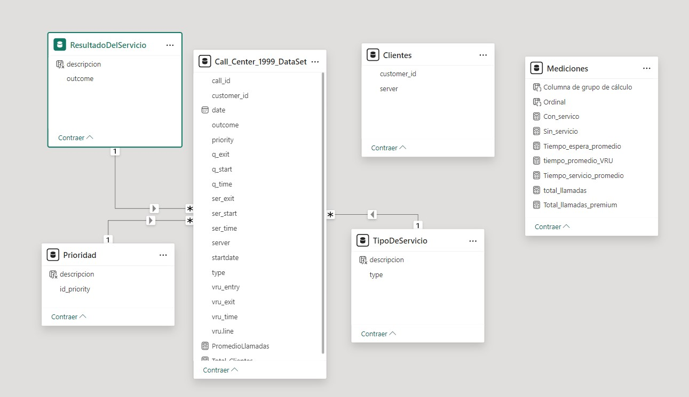

# Informe de Análisis del Centro de Llamadas - Banco Anónimo (1999)

## Descripción
Este repositorio contiene un informe de análisis de datos para el Centro de Llamadas del Banco Anónimo del año 1999. El informe ofrece información sobre las actividades de llamadas, incluyendo el volumen de llamadas, tipos de servicios, resultados y otras métricas relevantes. El análisis se presenta a través de paneles de Power BI, proporcionando una visión completa de las operaciones y el rendimiento del centro de llamadas.

## Contenido

1. **Paneles**:
   - **Resumen de Llamadas Totales**: Muestra el número total de llamadas recibidas por el centro de llamadas, desglosado por mes, resultado de la llamada y tipo de servicio.
   - **Análisis de Clientes Premium**: Se centra en los clientes premium, incluyendo el número total de llamadas premium, servicios prestados y indicadores clave de rendimiento como el tiempo promedio de espera y el tiempo de servicio.
   - **Vista del Modelo de Datos**: Proporciona una representación visual del modelo de datos utilizado en Power BI, mostrando las relaciones entre los diferentes conjuntos de datos.

2. **Archivos**:
   - `Total_Calls_Overview.png`: 
   - `Premium_Clients_Analysis.png`: 
   - `Data_Model_View.png`: 

## Fuentes de Datos
El análisis se basa en el conjunto de datos del Centro de Llamadas del Banco Anónimo del año 1999. El conjunto de datos incluye varios campos como ID de llamada, ID de cliente, fecha, resultado de la llamada, prioridad, tipo de servicio y marcas de tiempo para diferentes etapas del proceso de la llamada.

## Métricas Clave
- **Total de Llamadas**: 235,000
- **Distribución de Llamadas por Mes**: Representación visual del volumen de llamadas mensual.
- **Resultados de las Llamadas**: Distribución de las llamadas según los resultados (por ejemplo, atendidas por agente, colgadas, llamadas fantasma).
- **Tipos de Servicios**: Análisis de las llamadas por diferentes tipos de servicios ofrecidos.
- **Análisis de Clientes Premium**: Desglose de las interacciones y métricas específicamente para clientes premium, incluyendo el tiempo promedio de espera, tiempo de servicio y el número de llamadas con y sin servicio.

## Uso
Este informe es útil para comprender la eficiencia operativa del centro de llamadas, identificar los períodos pico de llamadas y evaluar el rendimiento de los servicios prestados. Puede servir como una línea base para comparaciones históricas o para establecer objetivos operativos futuros.

## Cómo Acceder a los Paneles
Los paneles están disponibles como capturas de pantalla en este repositorio. Para interactuar con los paneles y explorar más a fondo los datos, se requiere la descarga y acceso al archivo de informe de Power BI (Call_Center_1999.pbix).

